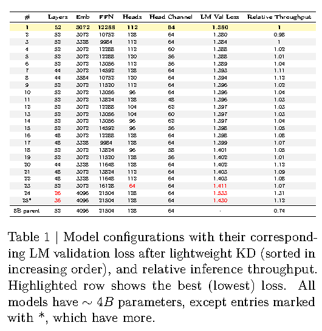
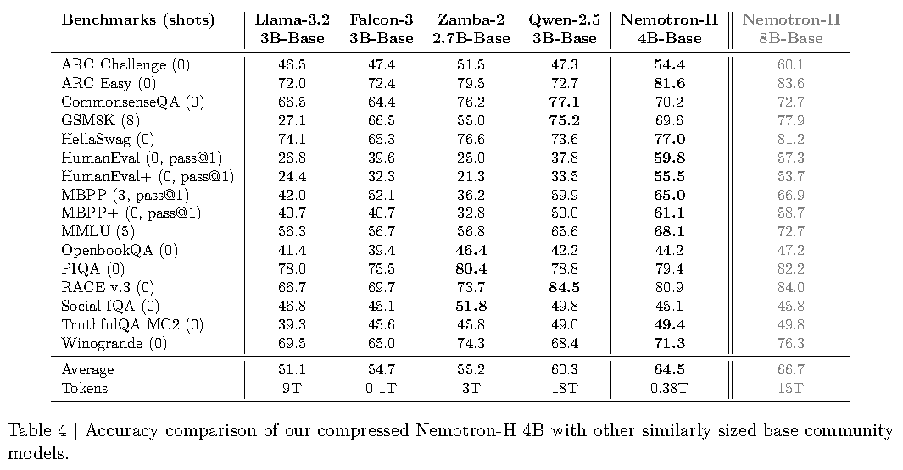

# Scaled Reproduction of Minitron-SSM

This repository is a scaled, public-data reproduction of the architecture
search, structured pruning, knowledge distillation (KD), and evaluation
pipeline introduced in **Minitron-SSM: Efficient Hybrid Language Model
Compression through Group-Aware SSM Pruning**.

> Ali Taghibakhshi et al., *Minitron-SSM: Efficient Hybrid Language Model
> Compression through Group-Aware SSM Pruning*, NeurIPS 2025.
>
> [arXiv abstract](https://arxiv.org/abs/2504.11409) |
> [paper PDF](https://arxiv.org/pdf/2504.11409) |
> [local PDF](Minitron-SSM.pdf)

## Paper and Method

Minitron-SSM compresses hybrid language models containing both Transformer
attention and Mamba/State Space Model (SSM) blocks. The main difficulty is that
Mamba heads participate in grouped SSM computations and therefore cannot be
pruned as independent, freely reorderable channels.

The paper's pipeline is:

1. Estimate activation-based importance for Mamba heads and head channels,
   feed-forward network (FFN) neurons, embedding channels, and layers.
2. Preserve Mamba group structure while pruning model width and optionally
   depth.
3. Search over more than 100 approximately 4B-parameter architectures.
4. Select promising candidates using validation loss and inference speed.
5. Recover pruning-induced accuracy loss using the original 8B model as a KD
   teacher.
6. Train the selected architecture with a much larger final KD budget.

The released Nemotron-H 4B model retains over 96% of the parent model's average
accuracy while improving inference efficiency.

## Reproduction Scope

The submitted plan in [ReproducingPlan.txt](ReproducingPlan.txt) selected:

- A reduced reproduction of the architecture search behind **Table 1**.
- Approximately 20 candidates instead of more than 120.
- The top 3 candidates instead of the paper's top 22.
- Short KD using the Nemotron-H 8B parent as teacher.
- A limited **Table 4** reproduction comparing our own parent, pruned, and
  KD-recovered checkpoints.
- No reproduction of instruct, long-context, safety, or Mamba2 experiments.

The executed scale was smaller than initially proposed because the unfused
Mamba fallback was both memory intensive and slow:

| Item | Paper | Submitted plan | Executed |
|---|---:|---:|---:|
| Search candidates | More than 120 | About 20 | 20 |
| Lightweight-KD candidates | 22 | 3 | 3 |
| Lightweight KD per candidate | 3.8B tokens | 200M tokens | 15M + optional 15M continuation |
| Final KD | About 380B tokens | Optional reduced run | About 35M-token final lineage |
| KD sequence length | 8192 | 8192 | 1024 |
| Main benchmark protocol | Mixed-shot | Reduced internal suite | Seven tasks, zero-shot |

The complete execution history and deviations from the plan are documented in
[minitron_ssm_reproduction_plan.md](minitron_ssm_reproduction_plan.md).

## Original Paper Results

### Paper Table 1: Architecture Search

The paper evaluates candidate architectures after 3.8B tokens of lightweight
KD. Width-pruned candidate 1 achieves the best validation loss; aggressive
depth-only candidates are faster but substantially less accurate.



Selected rows from the original table:

| Paper model | Layers | Embedding | FFN | Heads | Head channel | LM validation loss | Relative throughput |
|---|---:|---:|---:|---:|---:|---:|---:|
| Candidate 1 | 52 | 3072 | 12288 | 112 | 64 | **1.380** | 1.00 |
| Candidate 2 | 52 | 3072 | 10752 | 128 | 64 | **1.380** | 0.98 |
| Depth candidate 24 | 26 | 4096 | 21504 | 128 | 64 | 1.533 | 1.31 |
| 8B parent | 52 | 4096 | 21504 | 128 | 64 | - | 0.74 |

### Paper Table 4: Base-Model Benchmarks



The subset relevant to this reproduction is:

| Paper model | ARC-C | ARC-E | HellaSwag | PIQA | Winogrande | OpenBookQA | MMLU |
|---|---:|---:|---:|---:|---:|---:|---:|
| Nemotron-H 4B | 54.4 | 81.6 | 77.0 | 79.4 | 71.3 | 44.2 | 68.1 |
| Nemotron-H 8B | 60.1 | 83.6 | 81.2 | 82.2 | 76.3 | 47.2 | 72.7 |

MMLU is 5-shot in the paper. Our primary comparison is zero-shot, so its MMLU
column is not directly comparable.

## Our Results

### Reduced Table-1 Search

Twenty candidates were generated around the 4B target and evaluated on a fixed
one-million-token validation stream. The following three were selected by
validation loss and throughput.

| Rank | Candidate | Intended architecture `(emb, FFN, heads, channel)` | Planned params | Effective checkpoint params | Pre-KD loss | Batch-4 throughput vs. parent |
|---:|---|---|---:|---:|---:|---:|
| 1 | cand-009 | `(3328, 10752, 120, 48)` | 4.018B | 4.865B | 6.922 | 1.514x |
| 2 | cand-016 | `(3328, 10752, 104, 56)` | 4.029B | 4.865B | 6.922 | 1.514x |
| 3 | cand-006 | `(3328, 10752, 96, 60)` | 4.016B | 4.865B | 6.922 | 1.514x |

These losses must not be directly compared with the paper's Table 1 losses:
the dataset, KD budget, and evaluation stage differ. More importantly, the
effective checkpoint sizes reveal that the intended Mamba head/channel pruning
did not take effect. This limitation is discussed below.

The full 20-candidate table is available in
[candidate_table1.csv](outputs/report/candidate_table1.csv).

### KD Recovery

`cand-016` had the lowest terminal loss after the first 15M-token KD round and
was selected for the mini-final branch. The table reports each task's primary
lm-evaluation-harness metric: normalized accuracy for ARC, HellaSwag, PIQA, and
OpenBookQA; accuracy for Winogrande and MMLU.

| Checkpoint | KD lineage tokens | ARC-C | ARC-E | HellaSwag | PIQA | Winogrande | OpenBookQA | MMLU | Mean |
|---|---:|---:|---:|---:|---:|---:|---:|---:|---:|
| cand-016 pre-KD | 0 | 25.68 | 26.18 | 25.88 | 49.95 | 50.75 | 26.00 | 23.49 | 32.56 |
| cand-016 KD | 15.0M | 29.78 | 50.59 | 47.24 | 66.43 | **55.96** | 30.20 | 23.81 | 43.43 |
| cand-016 mini-final | 25.0M | 30.55 | 52.53 | 47.82 | 67.36 | 55.17 | 32.00 | 23.64 | 44.15 |
| cand-016 round-2 branch | 30.0M | 29.44 | 52.99 | 48.29 | **67.90** | 54.22 | 32.20 | 23.50 | 44.08 |
| cand-016 final | 35.0M | **31.14** | **53.87** | **48.94** | 67.68 | 54.22 | **33.40** | **24.56** | **44.83** |

The final checkpoint improves six of seven tasks over the pre-KD checkpoint.
Its mean primary accuracy rises by **12.27 percentage points**. MMLU improves
only 1.08 points, while commonsense and completion tasks recover much more
strongly. The 30M and 35M rows are different branches and their token counts
must not be added together.

Full data: [kd_recovery.csv](outputs/report/kd_recovery.csv).

### Internal Table-4 Comparison

All results below use the same seven-task zero-shot harness protocol. The
official NVIDIA 4B checkpoint is included as a reference; it was not trained by
this project.

| Model | ARC-C | ARC-E | HellaSwag | PIQA | Winogrande | OpenBookQA | MMLU | Mean |
|---|---:|---:|---:|---:|---:|---:|---:|---:|
| Nemotron-H 8B parent | **59.73** | **83.04** | **80.97** | **82.15** | **76.01** | **47.60** | **71.26** | **71.54** |
| Official NVIDIA 4B reference | 51.54 | 78.66 | 73.83 | 78.94 | 69.93 | 43.60 | 55.89 | 64.63 |
| cand-016 pre-KD | 25.68 | 26.18 | 25.88 | 49.95 | 50.75 | 26.00 | 23.49 | 32.56 |
| cand-016 KD 15M | 29.78 | 50.59 | 47.24 | 66.43 | 55.96 | 30.20 | 23.81 | 43.43 |
| cand-016 final 35M | 31.14 | 53.87 | 48.94 | 67.68 | 54.22 | 33.40 | 24.56 | 44.83 |

The reproduced parent scores closely track the paper's 8B row on the six
zero-shot tasks. The official 4B result is somewhat lower than the paper,
especially on zero-shot MMLU, where the paper used 5-shot evaluation.

Full metrics and standard errors:
[benchmark_compact.csv](outputs/report/benchmark_compact.csv).

### Efficiency

Measurements use one A100, BF16, 4096 input tokens, 256 generated tokens, two
warm-up iterations, and five measured iterations.

| Model | Batch | Tokens/s | TTFT (ms) | Peak memory (GiB) |
|---|---:|---:|---:|---:|
| Nemotron-H 8B parent | 1 | 3.116 | 305.2 | 21.54 |
| cand-016 final 35M | 1 | **4.679** | **202.1** | **15.48** |
| Nemotron-H 8B parent | 4 | 3.253 | 1177.6 | 40.81 |
| cand-016 final 35M | 4 | **4.862** | **791.5** | **34.72** |

The final checkpoint is approximately **1.50x faster**, with TTFT reduced to
0.66-0.67x of the parent. Its one-million-token held-out LM loss is **3.288**
(perplexity **26.801**).

Full data: [efficiency.csv](outputs/report/efficiency.csv).

## Reproduction Verdict

This project **partially reproduces** the paper:

- **Reproduced:** reduced architecture enumeration and ranking.
- **Reproduced:** short teacher-student KD on the top three candidates.
- **Reproduced:** strong benchmark recovery after KD.
- **Reproduced:** improved throughput, latency, and memory relative to the
  parent under the local measurement setup.
- **Not reproduced:** successful structural pruning of Mamba heads and head
  channels.
- **Not reproduced:** the paper's training scale or final benchmark quality.

During stage 4, Mamba pruning functions received the enclosing hybrid block
instead of its `block.mixer`. The functions therefore returned without slicing
Mamba tensors. FFN and embedding pruning were applied, but saved checkpoints
retained the parent's Mamba dimensions. This explains why candidates with
different intended Mamba widths have identical 4.865B effective parameter
counts and similar validation results.

Regenerating corrected checkpoints would require repeating pruning, all KD
branches, and all evaluations. The completed artifacts are therefore retained
and the issue is reported as a limitation rather than silently corrected after
the experiment.

Other limitations:

- Public FineWeb, StarCoder, OpenWebMath, and OASST1 data substitute for
  NVIDIA's unavailable Phase-3 mixture.
- KD used 1024-token sequences because the unfused Mamba path exceeded A100
  memory at longer sequence lengths.
- The final lineage saw about 35M KD tokens rather than 380B.
- The primary benchmark suite is zero-shot, including MMLU.
- A mixed-shot Table-4 attempt produced partial results, but generation tasks
  exceeded the available wall time and the official 4B 5-shot MMLU run OOMed.

## Code Structure

```text
configs/                         Experiment, data, search, KD, and eval settings
scripts/
  01_baseline.py                Parent loss and efficiency
  02_importance.py              Activation-based importance collection
  03_generate_candidates.py     Reduced architecture search space
  04_prune_candidates.py        Candidate checkpoint construction
  05_eval_candidates.py         Candidate loss and throughput
  06_select_top3.py             Candidate ranking
  07_kd_smoke.py                Short KD validation run
  08_kd_train.py                First 15M-token KD round
  08b_kd_train_round2.py        Optional second 15M-token round
  09_final_eval.py              Parent/pruned/KD benchmark evaluation
  09b_final_eval_from_results.py Follow-up checkpoint evaluations
  10_optional_mini_kd.py        Mini-final KD branch
  10b_mini_kd_round2.py         Mini-final continuation
  11_paper_table4_eval.py       Resumable mixed-shot evaluation attempt
  12_report_suite_eval.py       Stable seven-task final evaluation
  12_report_efficiency.py       Final loss and efficiency measurement
  13_finalize_report_artifacts.py Report tables and provenance manifest
src/minitron_ssm/
  data/                          Streaming mixture and token packing
  importance/                    Mamba, FFN, and embedding scores
  pruning/                       Mamba, FFN, embedding, and depth pruning
  search/                        Candidate generation and parameter counting
  kd/                            KD objectives, trainer, and cache
  eval/                          LM loss, generation efficiency, lm-eval wrapper
  models/                        Nemotron-H loading and inspection
  utils/                         Config, checkpoint, logging, and shape helpers
run_*.slurm                      Cluster launchers
submit_*.sh                      Robust submission wrappers
tests/                           Unit and integration tests
outputs/report/                  Compact final CSV/JSON report artifacts
```

## Installation

Python 3.10 and an NVIDIA CUDA environment are recommended. The completed runs
used A100 80GB GPUs and Torch 2.5.1.

```bash
git clone <repository-url>
cd MinitronSSM

conda create -n minitron python=3.10 -y
conda activate minitron

pip install -r requirements.txt
pip install -e .

# Required for Nemotron-H GPU execution. Match these packages to local CUDA.
pip install "mamba-ssm==2.*" "causal-conv1d>=1.4" --no-build-isolation
```

Hugging Face access and sufficient storage are required to download:

- `nvidia/Nemotron-H-8B-Base-8K`
- `nvidia/Nemotron-H-4B-Base-8K`
- The datasets listed in [configs/data.yaml](configs/data.yaml)

Validate the installation:

```bash
python -m pytest -q
python scripts/01_baseline.py --dry-run
python scripts/08_kd_train.py --dry-run
```

The final test run completed with **35 passing tests**.

## Running the Reproduction

All commands should be run from the repository root. Each stage consumes the
artifact produced by the previous stage.

### Direct Python Pipeline

```bash
# Baseline, importance, search, pruning, and selection
python scripts/01_baseline.py
python scripts/02_importance.py
python scripts/03_generate_candidates.py
python scripts/04_prune_candidates.py
python scripts/05_eval_candidates.py
python scripts/06_select_top3.py

# KD smoke test and top-three training
python scripts/07_kd_smoke.py
python scripts/08_kd_train.py --candidate-index 0
python scripts/08_kd_train.py --candidate-index 1
python scripts/08_kd_train.py --candidate-index 2

# Optional continuation branches
python scripts/08b_kd_train_round2.py --candidate-index 0
python scripts/08b_kd_train_round2.py --candidate-index 1
python scripts/08b_kd_train_round2.py --candidate-index 2
python scripts/10_optional_mini_kd.py --target-tokens 10000000
python scripts/10b_mini_kd_round2.py --target-tokens 10000000

# Evaluation and final report artifacts
python scripts/09_final_eval.py

python scripts/09b_final_eval_from_results.py \
  --kd-results outputs/eval/08_kd_results_round2.json \
  --output outputs/eval/09_final_eval_round2.json \
  --skip-parent --skip-pruned --harness-batch-size 1

python scripts/09b_final_eval_from_results.py \
  --mini-kd-json outputs/eval/10_mini_kd.json \
  --output outputs/eval/09_final_eval_mini_kd.json \
  --skip-parent --skip-pruned --skip-kd --harness-batch-size 1

python scripts/12_report_suite_eval.py \
  --target checkpoint --checkpoint outputs/checkpoints/cand-016 \
  --label cand-016-pre-kd --output outputs/eval/12_report_pre_kd.json \
  --batch-size 1
python scripts/12_report_suite_eval.py \
  --target checkpoint --checkpoint outputs/checkpoints/cand-016-kd \
  --label cand-016-kd-15m --output outputs/eval/12_report_kd15m.json \
  --batch-size 1
python scripts/12_report_suite_eval.py \
  --target checkpoint --checkpoint outputs/checkpoints/cand-016-mini-final2 \
  --label cand-016-mini-final2-35m \
  --output outputs/eval/12_report_final35m.json --batch-size 1
python scripts/12_report_suite_eval.py \
  --target reference --label official-nemotron-h-4b-native \
  --output outputs/eval/12_report_reference4b_native.json --batch-size 1
python scripts/12_report_efficiency.py \
  --checkpoint outputs/checkpoints/cand-016-mini-final2 \
  --label cand-016-mini-final2-35m \
  --output outputs/eval/12_report_final35m_efficiency.json \
  --num-loss-tokens 1000000

python scripts/13_finalize_report_artifacts.py
```

The three calls for each KD round are independent and should normally run on
separate GPUs.

### Slurm Pipeline

The provided launchers encode the A100 configuration used in this project.
Submit stages only after their prerequisites have completed:

```bash
sbatch run_baseline.slurm

# Run scripts/02_importance.py in a GPU allocation, then:
sbatch run_overnight.slurm

sbatch run_kd_train.slurm
sbatch run_kd_train_round2.slurm
sbatch run_final_eval.slurm
sbatch run_mini_kd.slurm
bash submit_mini_kd_round2.sh
bash submit_final_eval_followups.sh

# Five independent final evaluation tasks
bash submit_report_campaign.sh

# CPU-side consolidation after all evaluations complete
python scripts/13_finalize_report_artifacts.py
```

Cluster-specific paths, partition names, and node exclusions in the Slurm
files must be changed for another system.

## Artifacts and Reproducibility

The most useful final artifacts are:

- [candidate_table1.csv](outputs/report/candidate_table1.csv): 20-candidate
  architecture and efficiency summary.
- [kd_recovery.csv](outputs/report/kd_recovery.csv): aligned KD recovery curve.
- [benchmark_compact.csv](outputs/report/benchmark_compact.csv): compact
  seven-task benchmark table.
- [efficiency.csv](outputs/report/efficiency.csv): throughput, TTFT, memory, and
  loss measurements.
- [job_checkpoint_manifest.json](outputs/report/job_checkpoint_manifest.json):
  source hashes, Slurm records, execution lineage, and 29 checkpoint records.
- [09_final_eval_compact.json](outputs/eval/09_final_eval_compact.json):
  483KB compact copy of the original 407MB stage-09 result.

Large checkpoints, logs, and per-example evaluation data are excluded by the
default `.gitignore`. The compact `outputs/report/` artifacts and compact
stage-09 result are intentionally retained so the tables in this README can be
audited without the multi-gigabyte checkpoints.

## Conclusion

At this reduced scale, KD clearly recovers a large fraction of the performance
lost after pruning, and the resulting checkpoint improves local inference
speed and latency. However, the final model remains far below the official
Nemotron-H 4B model because the reproduction used drastically fewer tokens,
shorter sequences, substitute data, and did not successfully apply structural
Mamba pruning.

The experiment therefore supports the paper's broad KD-recovery and
accuracy-efficiency trends, but it does not constitute a full reproduction of
the paper's group-aware Mamba pruning result.
